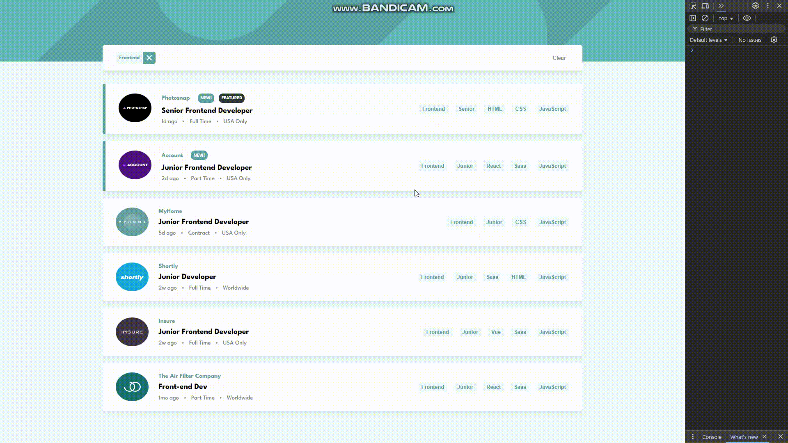

# static-job-listings-master

Hello everyone. Thanks to the course I took on Udemig, I added a new one to my projects. Here is a "Static job listings master Project" created with react.
It allows filtering the details of the listed jobs.
# Usage Tecnologies

- Html
- Css
- Js
- React

It is compatible with mobile and tablet devices with responsive design.

# Short Gif

